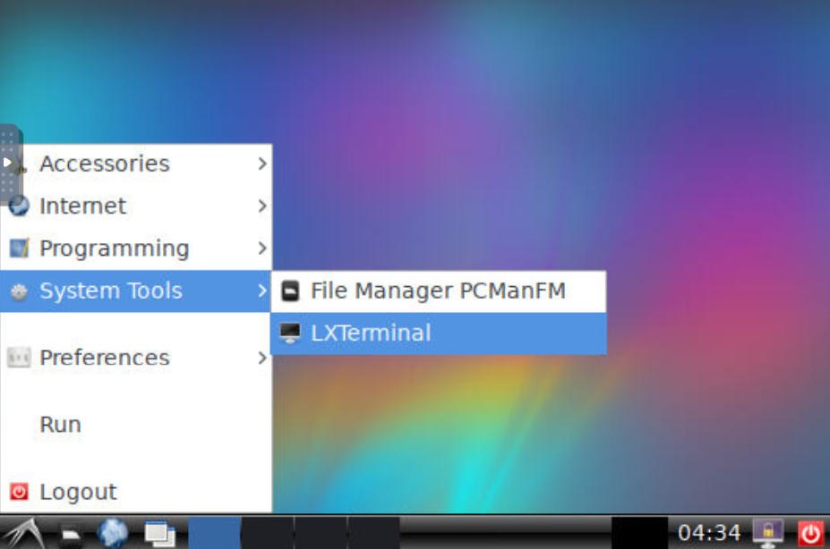
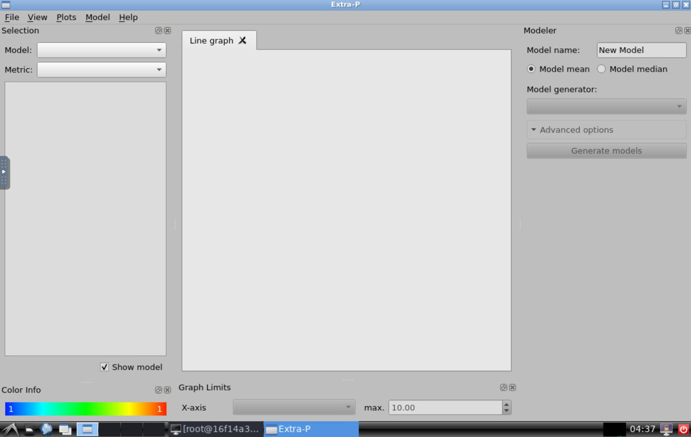
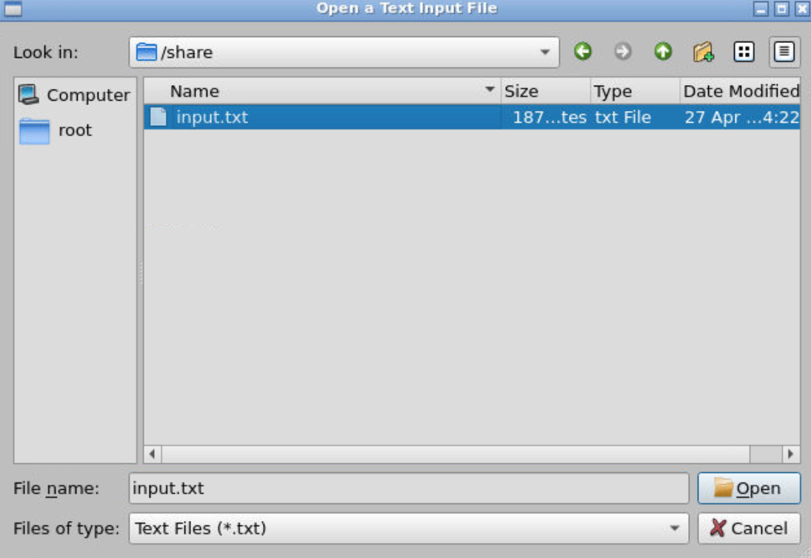

## How to use

1. Execute `docker-compose up` at `/DockerEnv/`.
2. Few seconds later, access to `localhost:8080` with your browser.
3. launch `LXTerminal`

4. execute `extrap-gui`

## Sharing files between host and container

Use `/DockerEnv/share/` to share files , then those files will be `/share` on Extra-P container.

