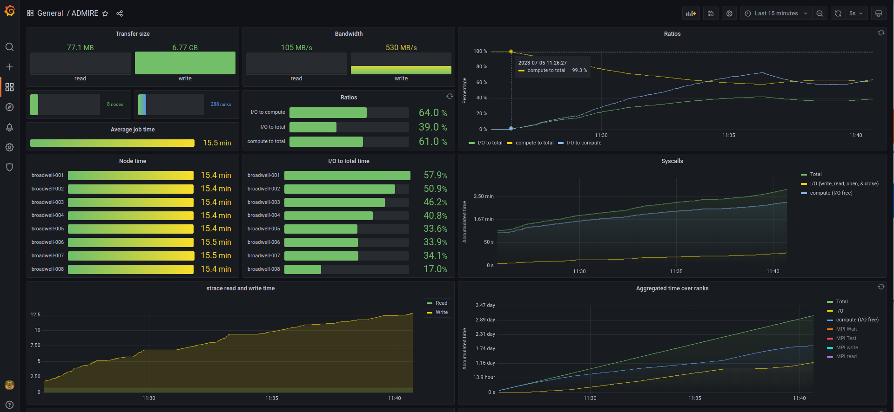
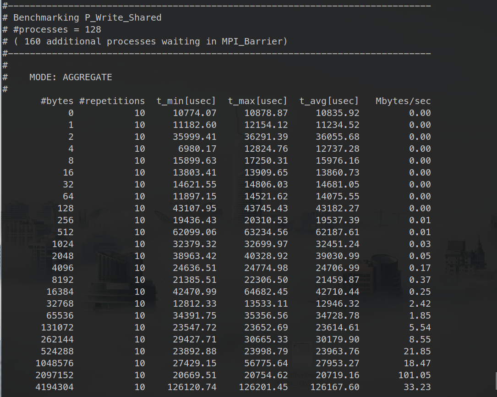
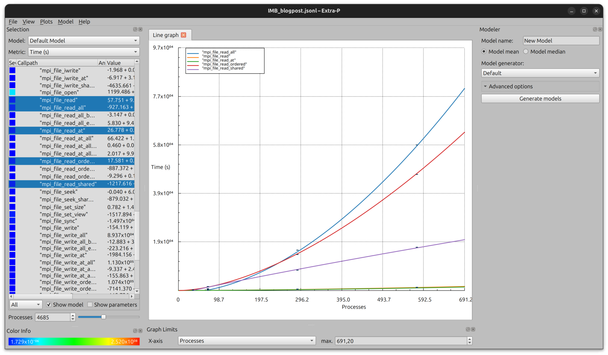
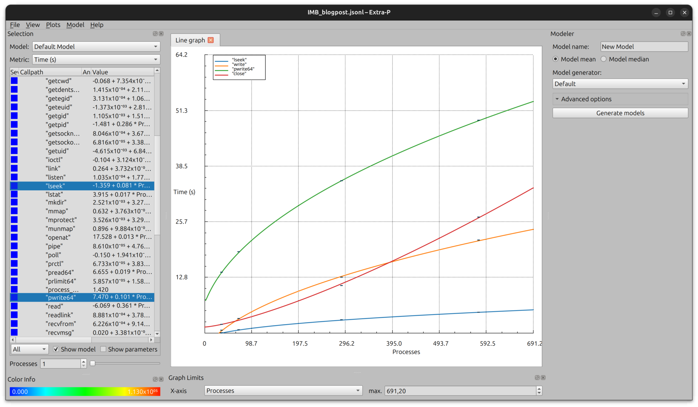
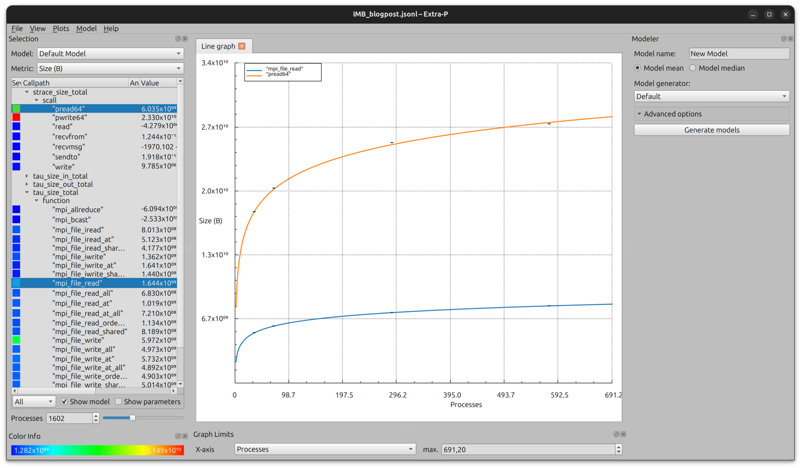

Modeling I/O Performance With Extra-P
=====================================
*July 27, 2023 by [Ahmad Tarraf](https://admire-eurohpc.eu/author/ahmad/ "View all posts by Ahmad Tarraf")*

> The original article can be found on the ADMIRE blog: [https://admire-eurohpc.eu/extrap-model/](https://admire-eurohpc.eu/extrap-model/)

In high-performance computing (HPC), large scientific applications are usually executed on huge clusters with a vast number of resources. Twice a year, the [Top 500 list](https://www.top500.org/lists/) presents the top performers in this field. As these systems increasingly become more complex and powerful, so do the applications across various domains (e.g., fluid dynamics, molecular dynamics, and environmental simulations) that try to exploit these systems as much as possible. However, scalability bugs can lead to performance bottlenecks preventing the effective usage of such systems. Identifying scalability bugs at an early stage of the development process is an indispensable prerequisite to ensure early and sustained productivity. In this context, performance modeling plays an essential role.

Indeed, performance modeling has been long around, especially in HPC. Typically, these models describe the scalability of an application on a particular system. In particular, a performance model is a mathematical formula that expresses a performance metric of interest, such as execution time or energy consumption, as a function of one or more execution parameters (e.g., the size of the input problem or the number of processors). There are various tools out there to generate performance models. [Extra-P](https://github.com/extra-p/extrap), for example, is an automatic performance-modeling tool that generates empirical performance models.

Performance models are often concerned with the scalability of computational or communications parts of the code. However, input/output (I/O) aspects are often overlooked in HPC. The [storage wall](https://link.springer.com/article/10.1631/FITEE.1601336), a recently introduced term, tries to quantify the I/O performance bottleneck from the application scalability perspective. Indeed, as I/O subsystems have not kept up with the rapid enhancement of the other resource on an HPC cluster, their limitations are often encountered in practice for various reasons (I/O contention, hardware restrictions, file system schematics, etc.). Thus, there is a need to analyze the scalability behavior of an application regarding I/O to not only improve the I/O usage of an application but rather steer the global consumption of the system as much as possible. This has been one of our goals in the [ADMIRE](https://admire-eurohpc.eu/) project.

Following the reusability principle and thus instead of developing a new dedicated tool for this purpose, we used the exciting tool _Extra-P_ to model the scalability of I/O. In particular, using the [monitoring infrastructure](https://admire-eurohpc.eu/towards-i-o-nmonitoring-at-scale/) developed in the ADMIRE project, the obtained I/O metrics are forwarded to Extra-P to generate I/O performance models.

Extra-P offers a generic interface for various data formats. That is, it’s relatively straightforward to input the data into the tool and generate performance models with it. The tool supports various input formats as described in its documentation ([see Extra-P documentation](https://github.com/extra-p/extrap/blob/master/docs/file-formats.md)). For our purposes, we choose the JSON Lines format. This allows us to constantly append newly obtained data from the monitoring infrastructure to the same file. Moreover, this file format is easy-to-interpret, which is crucial for early deployment.

To demonstrate the approach, we executed the [IMB-IO](https://www.intel.com/content/www/us/en/docs/mpi-library/user-guide-benchmarks/2021-2/overview.html) benchmarks on the [cluster](https://hpc4ai.unito.it/documentation/) at Turin. During the execution of the benchmarks, we monitor the application using ADMIRE’s [monitoring infrastructure](https://admire-eurohpc.eu/towards-i-o-nmonitoring-at-scale/). To visualize the results that are stored in the Prometheus database, we created a Grafana dashboard:

For IMB-IO, we executed the benchmark suite with the default settings, except for the interaction flag, which was set to 10. By default, a single benchmark is repeated with a [different number of processes](https://www.intel.com/content/www/us/en/docs/mpi-library/user-guide-benchmarks/2021-2/running-intel-r-mpi-benchmarks.html#RUNNING), such that the highest number is limited to the number of ranks. For example, the run with eight nodes with a total of 288 processes is repeated for the following process configurations: 1, 2, 4, 8, 16, 32, 64, 128, 256, and 288. Hence, as observed in the upper figure, the I/O to total ratio varies between the compute nodes. A screenshot during the simulation with 288 processes at 128 ranks performing I/O is shown below:

Note that this benchmark is not concerned with process malleability but rather leaves the _unused_ processes at an MPI\_Barrier.

Next, we repeated the experiment with up to 16 nodes corresponding to 576 processes. Once done, and with the help of the tau profile client, the traces can be converted into profiles. Moreover, the profiles of the different runs are grouped based on the call. The output is a single JSON Lines file containing the profiles over the different configurations.

During the parsing processes, the collected information is grouped so that similar metrics (e.g., transfer size, hits, or time) are shown together in Extra-P. This way, instead of displaying absolute call paths in Extra-P, we show the call path relative to the tools used to capture the information. For example, we capture the MPI-related information with tau, while strace is used to capture the syscalls. Hence, for the experiments performed previously, the scaling behavior regarding, for example, the blocking MPI-IO read functions are shown in the figure below:

As observed, the MPI\_File\_read\_at function scales the best regarding the execution time. Considering the strace metrics, below we show the scaling behavior of some syscalls, including _sleek_, _close_, and _write_:

Traditional performance modeling is usually mainly concerned with execution time and problem size. For I/O, other metrics, such as the scaling behavior of transferred bytes and function visits, might also be interesting. For the _MPI\_File\_read_ as well as for the _pread64_ functions, the scaling behavior in terms of bytes is shown below:

With this approach, we are one step closer to fulfilling the [objectives](https://admire-eurohpc.eu/33-2/objectives/) of the ADMIRE project. In particular, one of our objectives includes the creation of an active I/O stack that dynamically adjusts computation and storage requirements through intelligent global coordination. This coordination is the task of the [intelligent controller](https://admire-eurohpc.eu/) that aims at maximizing the performance of the system through various means, including for example, balancing computational with storage performance. By generating performance models for the various parts of an application, the intelligent controller can now make effective decisions that balance the resources, especially in the context of malleability. This becomes especially interesting considering the various components of the I/O stack on modern HPC systems. Stay tuned for more modeling approaches in our upcoming posts.

----------------------------------------------------------------------------------------------
Link to Extra-P Github: [https://github.com/extra-p/extrap](https://github.com/extra-p/extrap)  
[More about the approach](https://hal.science/hal-04093528/)  
[More about the author](https://www.linkedin.com/in/dr-ahmad-tarraf-8b6942118/?originalSubdomain=de)

**Categories** [Uncategorized](https://admire-eurohpc.eu/category/uncategorized/)  
**Tags** [ADMIRE](https://admire-eurohpc.eu/tag/admire/), [Application](https://admire-eurohpc.eu/tag/application/), [Extra-P](https://admire-eurohpc.eu/tag/extra-p/), [I/O](https://admire-eurohpc.eu/tag/i-o/), [Modeling](https://admire-eurohpc.eu/tag/modeling/)

-----------

This project has received funding from the European Union’s Horizon 2020 JTI-EuroHPC research and innovation programme, with grant Agreement number: 956748

© 2023 Adaptative Multi-tier Intelligent data manager for Exascale 
