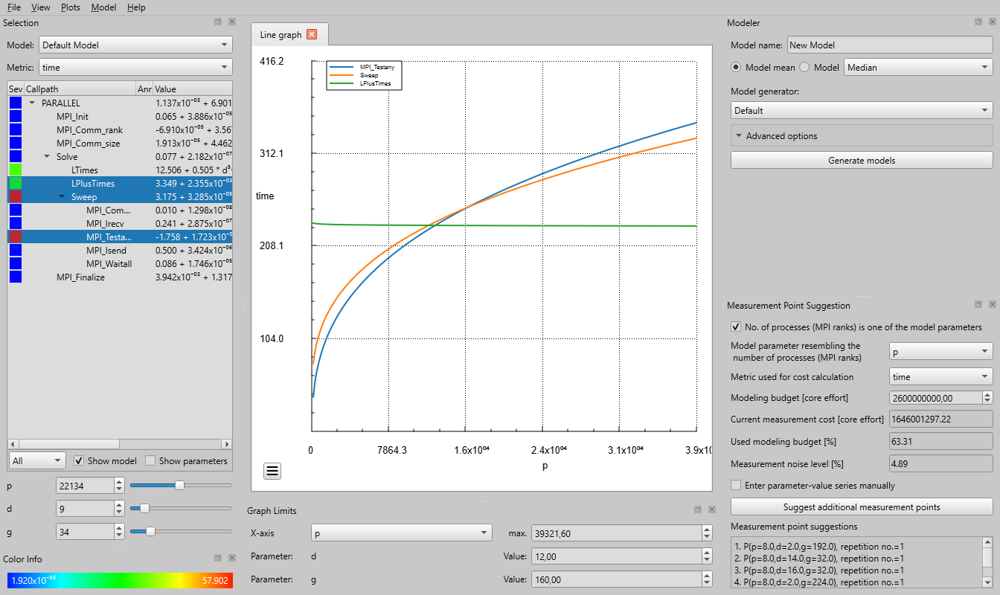
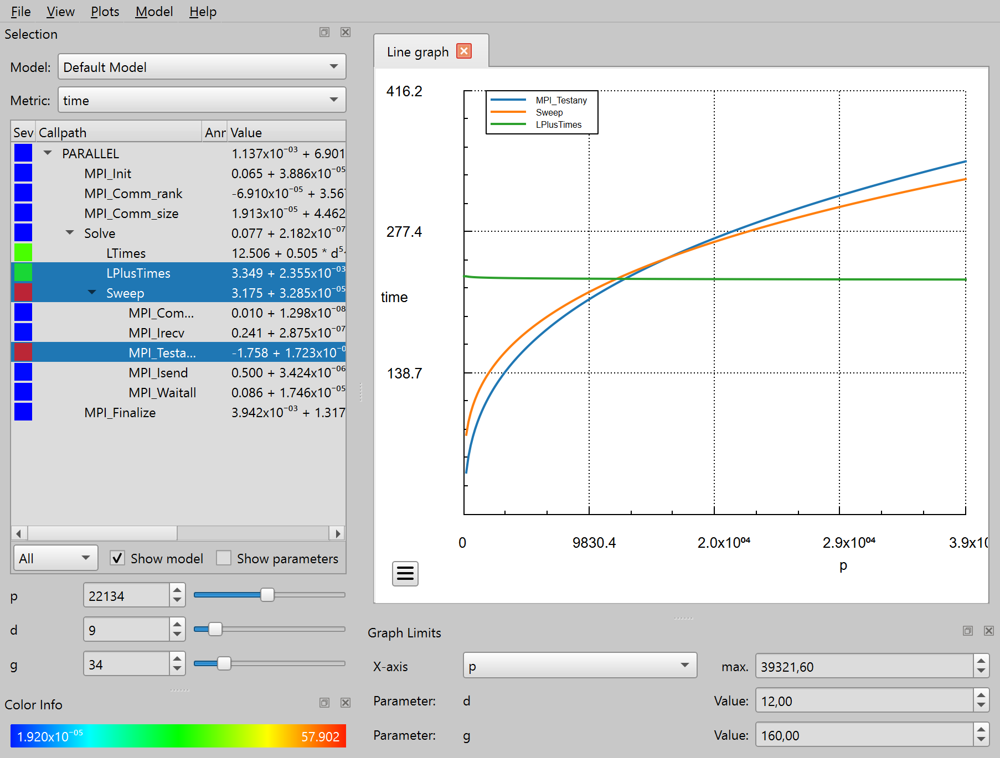

Quick Start
===========
This guide will show you how to use Extra-P, 
starting with the installation of Extra-P and the creation of measurement files, ending with the saved performance model.
If you already have files containing measurement data, you may want to skip to [using the GUI](#Graphical-user-interface).

### Table of contents 
* [Installing Extra-P](#installing-extra-p)
* [Creating Extra-P text files](#creating-extra-p-text-files)
* [How to use the graphical user interface](#graphical-user-interface)
    - [Starting Extra-P](#starting-extra-p)
    - [Loading files](#loading-files)
    - [Modeling data](#modeling-data)
    - [Saving performance models](#saving-performance-models)
* [How to use the command-line interface](#command-line-interface)
    - [Starting Extra-P](#starting-Extra-P-1)
    - [Loading files](#loading-files-1)
    - [Modeling data](#modeling-data-1)
    - [Saving performance models](#saving-performance-models-1)


Installing Extra-P
------------------
Please, make sure you use Python version 3.7 or greater.
To install Extra-P, you can use `pip`, the python package manager. 
Use the following command to install Extra-P.

```
pip install extrap
```

Creating Extra-P text files
---------------------------
We start with a simple example based on the Extra-P text format.
First, measurement data from your program or system must be obtained.
Therefore, you should select at least five measuring points of your parameter.
For each of these points, we recommend that you measure your program at least 5 times.
After measuring, you will have measurement results similar to those in the table below.
To simplify the example, we repeated the measurements only three-times.

| p  | Measurement 1 | Measurement 2 | Measurement 3 |
|----|---------------|---------------|---------------|
| 4  |          8.31 |          8.02 |          8.14 |
| 8  |         22.74 |         22.66 |         23.20 |
| 16 |         65.79 |         64.74 |         66.62 |
| 32 |        186.78 |        184.68 |        181.58 |
| 64 |        528.86 |        522.44 |        531.78 |

> ###### Hint
> The selection and scaling of parameters can affect the modeling outcome.
> For example, if your parameter is the edge length of a qudratic matrix,
> it can be insightful to model the number of entries in the matrix instead.

The measurement results must be converted before Extra-P can use them. In this example we use
the [text file format](file-formats.md#text-file-format). Other possible formats can be found in
the [file formats documentation](file-formats.md). The text file format consists of 5 sections. We will create them in
the following. First, we create the parameter section:

```
PARAMETER p
```

Second, we need to create the section containing the coordinates of our measurements as follows:

```
POINTS (4) (8) (16) (32) (64)
```

Third, give a name to our data:

```
REGION example
```

Fourth, add the metric name:

```
METRIC time
```

Fifth, write one `DATA` line per coordinate, which contains all repetitions at that position:

```
DATA 8.31 8.02 8.14
DATA 22.74 22.66 23.20
DATA 65.79 64.74 66.62
DATA 186.78 184.68 181.58
DATA 528.86 522.44 531.78
```

The final text file looks like this:

```
PARAMETER p
POINTS (4) (8) (16) (32) (64)

REGION example
METRIC time
DATA 8.31 8.02 8.14
DATA 22.74 22.66 23.20
DATA 65.79 64.74 66.62
DATA 186.78 184.68 181.58
DATA 528.86 522.44 531.78
```

You can find it in the examples folder: [examples/input.txt](examples/input.txt)

Graphical user interface
------------------------
Extra-P can be used in two ways: the graphical user interface or the command-line interface.
From here on, we will describe how you can perform basic tasks with the graphical user interface.



### Starting Extra-P
To start Extra-P in GUI-mode, you should execute the `extrap-gui` command in your terminal.

### Loading files
Extra-P supports several file formats; these are described in the [file formats documentation](file-formats.md).
For loading a file, you must choose the matching entry from the _File_ menu.


When a file is opened, Extra-P automatically creates models for all measurements in the file.
This does not happen if the file is an Extra-P experiment, in this case, the saved models are loaded from the experiment.

If we want to load the example file created in the previous section, we choose _Open text input_ from the _File_ menu.
And select the file [examples/input.txt](examples/input.txt) in the selection dialog. 
Extra-P will automatically create a model for 

### Modeling data
Extra-P automatically creates/loads models if a file is opened.
If you want to change the modeling technique (_Model generator_) or the type of value aggregation, you can use the 
_Modeler_ panel.
The type of value aggregation selects how the value for multiple repetitions are combined.
Depending on the selected model generator, you may also select different _Advanced options_.
You can give your model a name using the _Model name_ field.
Once you finished all settings, you must press _Generate models_ to generate new models based on your options.


### Viewing performance models
If multiple performance models are created, you can select one using _Model_ in the _Selection_ panel.
Below _Model_, you can choose the modeled _Metric_.
The performance models are then shown in the list/call tree below the selection, including the calculated errors and other statistical quality control metrics.

Extra-P features four statistical quality control metrics: the $RSS$ [(residual sum of squares)](https://en.wikipedia.org/wiki/Residual_sum_of_squares), $SMAPE$ [(Symmetric mean absolute percentage error)](https://en.wikipedia.org/wiki/Symmetric_mean_absolute_percentage_error), $RE$ [(relative error)](https://mathworld.wolfram.com/RelativeError.html), and $Adj. R^2$ [(adjusted coefficient of determination)](https://en.wikipedia.org/wiki/Coefficient_of_determination#Adjusted_R2).

Depending on the modeler configuration Extra-P uses either the $SMAPE$ or $RSS$ metric to identify the best performance model for a callpath metric combination from all possible hypotheses existing in the specified search space.

The $Adj. R^2$ metric provides insights into how well the found model replicates/predicts the metric values observed in the conducted performance measurements while also acknowledging the complexity of the found performance model.



If you select models in the call tree, you can view the extrapolation of their performance behavior in a graph.
The graph's limits can be set in the _Graph Limits_-panel to control the extrapolation.
Furthermore, two-dimensional plots are available in the _Plots_ menu. 
Depending on the graph type, you can modify the graphs using panning or the context menu. 

Below the call tree, you find controls that help you quickly discover scaling issues. 
If you select a target configuration, the colored boxes in the call tree inform you of the scaling behavior of each kernel compared to the other kernels. The color scale of this can be seen in the _Color Info_ panel. 
If you want to see the predicted value of your selected metric, you can uncheck _Show Models_.

### Saving performance models
If you want to save only the models of a few kernels, you can copy them using the context menu of the call tree.
If you want to save all models, so you can review them later, you can select _Save experiment_ from the _File_ menu.
The saved experiment includes all data required to generate new performance models, 
so you can use other modeling configurations later. 
Furthermore, you can save screenshots of Extra-P using the _Screenshot_ command from the _File_ menu.
It is also possible to save a screenshot of only the plots/graphs using the integrated toolbar or the context menu.   

Command-line interface
----------------------

### Starting Extra-P
The command-line interface can be accessed using the `extrap` command.
If you need details regarding available arguments, you can use the `--help` option.

### Loading files
To load a file, you must specify its file path as an argument for Extra-P. 
Depending on the file type, you must use one of the following filetype options:

| Input options |                                        |
|---------------|----------------------------------------|
| `--cube`      | Load data from CUBE files              |
| `--text`      | Load data from text files              |
| `--talpas`    | Load data from Talpas data format      |
| `--json`      | Load data from JSON or JSON Lines file |
| `--extra-p-3` | Load data from Extra-P 3 experiment    |

Combined, you get a command structured like this:

`extrap` (`--cube` | `--text` | `--talpas` | `--json` | `--extra-p-3`) _FILEPATH_

If we want to load the previously created example file, we use the following command:

```
extrap --text examples/input.txt
```

### Modeling data
Extra-P automatically creates models if its executed, 
nevertheless, you have several options to tweak the modeling process.
You can switch the type of value aggregation from mean to median by adding the `--median` flag.
The type of value aggregation selects how the value for multiple repetitions are combined.
The modeling technique can be selected using the `--modeler`-option followed by the name of the modeler. 

Depending on the selected model generator, you may also set different options for the modeler 
using `--options` followed by a list of _KEY_=_VALUE_ pairs.
If you need information which options are available for a modeler 
you can use the `--help-modeler` argument followed by the modeler name.

If we want to model the __median__ of the previously created example file with the __Refining__ modeler, 
we use the following command:

```
extrap --median --modeler Refining --text examples/input.txt
```

### Viewing performance models

By default, Extra-P outputs the performance models and the coordinates to the console. You can change what is printed
using the `--print` option followed by one of (`all`, `callpaths`, `metrics`, `parameters`, `functions`, `latex-functions`). If you want to
control the output to a finer degree, you can specify a [formatting string using placeholders](output-formatting.md).

### Saving performance models

If you want to save the text output, you can use the `--out` option followed by a file path.
If you want to save all models, so you can review them later in the GUI, 
you can use `--save--experiment` followed by a file path.
The saved experiment includes all data required to generate new performance models, 
so you can also use other modeling configurations later. 
Furthermore, you may use both options together to save the experiment and the output file.
